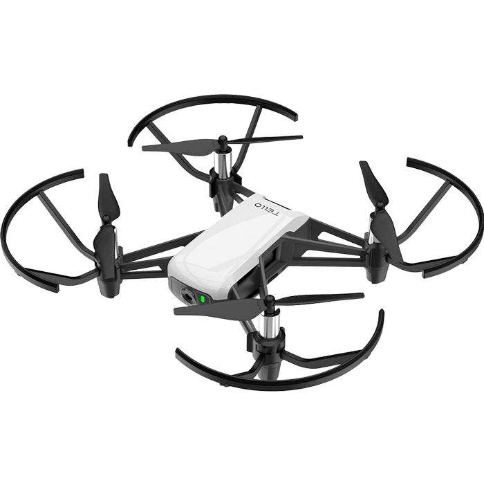

# DJI Tello pose control
This project enables you to control the DJI Tello drone with your body pose

<p align="center">
   
</p>

## Pose Detection
The pose detection code is based on the work found in this repository https://github.com/Hzzone/pytorch-openpose

#### Download the Models

* [dropbox](https://www.dropbox.com/sh/7xbup2qsn7vvjxo/AABWFksdlgOMXR_r5v3RwKRYa?dl=0)
* [baiduyun](https://pan.baidu.com/s/1IlkvuSi0ocNckwbnUe7j-g)
* [google drive](https://drive.google.com/drive/folders/1JsvI4M4ZTg98fmnCZLFM-3TeovnCRElG?usp=sharing)

`*.pth` files are pytorch model, you could also download caffemodel file if you want to use caffe as backend.

Download the pytorch models and put them in a directory named `model` inside the `res` directory

## Controlling DJI Tello
To interact with the drone I use the [djitellopy](https://github.com/damiafuentes/DJITelloPy) library.

This is a DJI Tello drone python interface using the official [Tello SDK](https://dl-cdn.ryzerobotics.com/downloads/tello/20180910/Tello%20SDK%20Documentation%20EN_1.3.pdf) and [Tello EDU SDK](https://dl-cdn.ryzerobotics.com/downloads/Tello/Tello%20SDK%202.0%20User%20Guide.pdf).

#### Simple example
```python
from djitellopy import Tello

tello = Tello()

tello.connect()
tello.takeoff()

tello.move_left(100)
tello.rotate_counter_clockwise(90)
tello.move_forward(100)

tello.land()
```

#### For more information on djitellopy
See [djitellopy.readthedocs.io](https://djitellopy.readthedocs.io/en/latest/) for a full reference of all classes and methods available.


